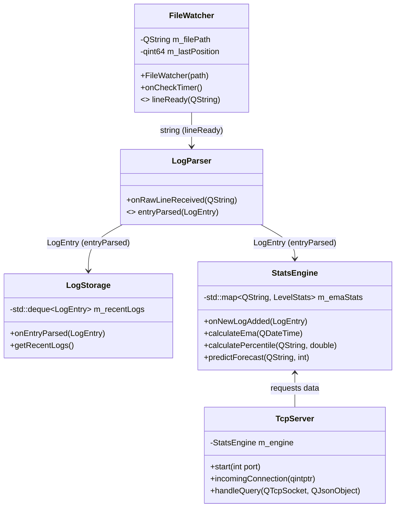
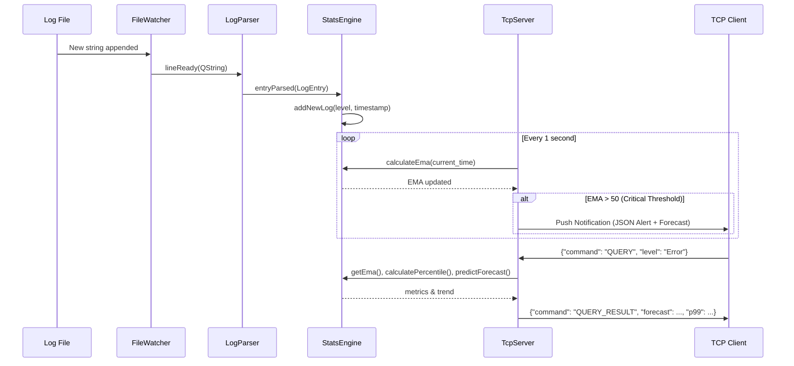

# Пояснительная записка: Серверная часть подсистемы мониторинга журналов (LogWatch)

## 1. Введение и назначение
Программный модуль (серверная часть) предназначен для асинхронного мониторинга, потоковой обработки и агрегации лог-файлов с последующей трансляцией вычисленных статистических метрик по протоколу TCP. Проект разработан в соответствии с требованиями технического задания и ориентирован на работу в ОС Windows. Архитектура приложения строится по принципу MVC/MVVM с глубоким разделением слоев логики, хранения и транспорта.

## 2. Архитектура программного комплекса
Архитектура сервера построена по модульному принципу на базе фреймворка Qt 5. Компоненты слабо связаны друг с другом и взаимодействуют преимущественно посредством механизма сигналов и слотов (Signals & Slots), что обеспечивает потокобезопасность и возможность легкого масштабирования.

## 3. Описание модулей и структур данных

### 3.1. Структуры данных (`utils.h`)
* `LogEntry` — базовая единица данных, описывающая одно событие. Содержит поля: метка времени (`timestamp`), уровень критичности (`level`), источник (`source`), код (`code`) и текст сообщения (`message`).
* `TrendLine` — структура, описывающая аппроксимированную прямую $y = kx + b$.

### 3.2. Модуль потокового чтения (`FileWatcher`)
Реализует инкрементальное чтение файлов без полной загрузки в оперативную память. Использует таймер для периодического поллинга размера файла. При увеличении размера считывает дельту (новые строки), обновляя указатель `m_lastPosition`. Это полностью соответствует требованию ТЗ об аналоге `tail -f`.

### 3.3. Модуль синтаксического анализа (`LogParser`)
Использует конечный автомат на базе регулярных выражений (`QRegularExpression`) для извлечения структурированных данных из неструктурированного текста. Сложность парсинга $O(N)$, где $N$ — длина строки.

### 3.4. Хранилище и агрегация (`LogStorage`)
Для обеспечения константного времени доступа $O(1)$ при добавлении и удалении элементов используется `std::deque`. Буфер имеет фиксированный максимальный размер. При его переполнении применяется политика FIFO (First In, First Out).

### 3.5. Математическое ядро (`StatsEngine`)
Отвечает за расчет статистических показателей согласно ТЗ без использования сторонних математических библиотек:
1. **Экспоненциальная скользящая средняя (EMA)**: Вычисляется по формуле $EMA_t = \alpha \cdot x_t + (1 - \alpha) \cdot EMA_{t-1}$, где $\alpha$ — коэффициент сглаживания. В расчет берется окно заданной длины (по умолчанию 60 секунд).
2. **Перцентили (P90, P95, P99)**: Расчет производится путем сортировки массива временных интервалов и выбора элемента по индексу $i = \lceil P \cdot N \rceil - 1$.
3. **Тренд и прогнозирование**: Аппроксимация исторической выборки EMA с помощью метода наименьших квадратов (МНК). Прогнозирование осуществляется экстраполяцией полученной функции на заданное клиентом (или дефолтное) количество временных шагов вперед.

### 3.6. Сетевой модуль (`TcpServer`)
Реализует асинхронный сервер на базе `QTcpServer`. Взаимодействие с клиентами осуществляется посредством JSON-RPC подобного протокола поверх TCP-сокетов (`QTcpSocket`). 

## 4. Алгоритм потока данных (Data Flow)

Динамика обработки одного события лога представлена на sequence-диаграмме:

## 5. Протокол информационного обмена
Обмен данными реализован сериализацией JSON в массив байт с разделителем `\n` (newline-delimited JSON).
* **Поддерживаемые запросы клиента**: `SUBSCRIBE`, `UNSUBSCRIBE`, `PING`, `QUERY`.
* **Пример ответа сервера на команду `QUERY`**:
  Пакет включает текущее значение `ema`, перцентили `p90, p95, p99`, коэффициенты тренда `trend_b, trend_k`, массив строк `logs` и краткосрочный прогноз `forecast`.
